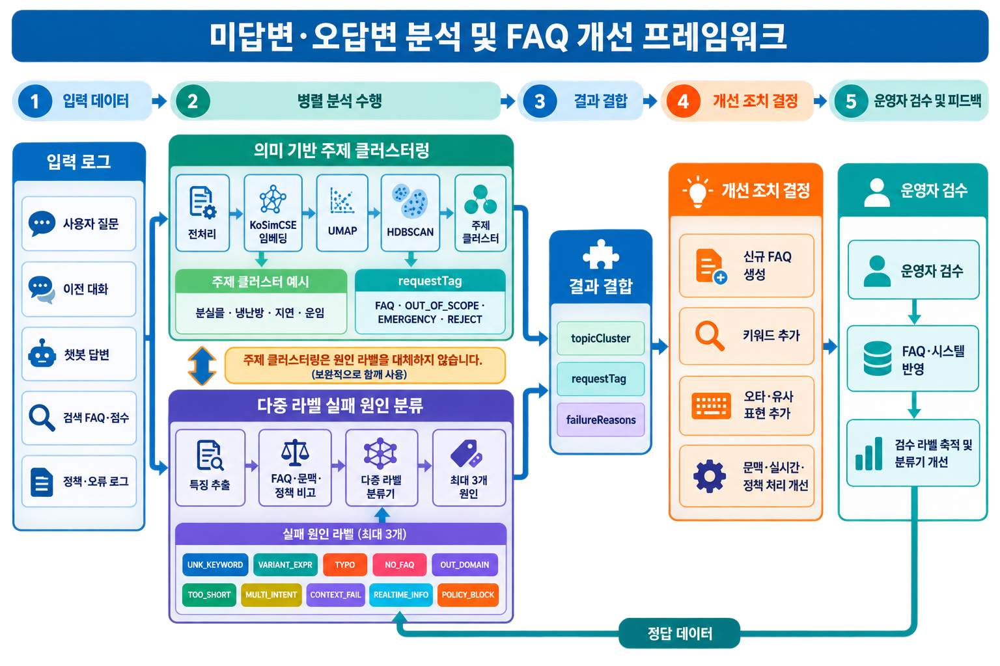

# 미답변·오답변 분석 및 FAQ 개선 프레임워크

## 1. 문서 목적

현재 시스템은 의미 기반 클러스터링을 중심으로 미답변·오답변 질문을 묶고 FAQ 후보를 생성한다. AI 서버, 백엔드 서버, API 및 AI 모델이 이미 연결되어 있으므로 현재 구조를 즉시 교체하지 않는다.

이 문서는 향후 필요할 때 기존 API 호환성을 유지하면서 다음 기능을 단계적으로 추가하기 위한 설계 방향을 정리한다.

- 질문의 주제와 의미를 찾는 **의미 기반 클러스터링**
- 기존 챗봇이 실패한 이유를 찾는 **다중 라벨 원인 분류**
- 원인에 따라 신규 FAQ 생성, 기존 FAQ 확장, 시스템 개선을 구분하는 **개선 조치 결정**



## 2. 현재 시스템

### 2.1 처리 흐름

```text
미답변·오답변 파일 업로드
→ 질문 전처리
→ KoSimCSE 임베딩
→ UMAP 차원 축소
→ HDBSCAN 의미 클러스터링
→ Qwen 기반 FAQ 후보 및 requestTag 생성
→ KB 검색 및 답변 생성·평가
→ 백엔드 페이로드 반환
```

### 2.2 현재 클러스터링의 역할

현재 클러스터링은 전처리된 질문 문장 `normalizedForClustering`을 사용하여 의미가 비슷한 질문을 묶는다.

- 입력: 질문 문장
- 출력: `clusterId`, 클러스터 크기, 대표 키워드, 질문 샘플
- 목적: 반복적으로 발생하는 질문 주제 발견
- 예시: 분실물, 냉난방, 열차 지연, 소음, 운임

대표 키워드는 클러스터를 생성한 후 c-TF-IDF로 추출한다. 따라서 키워드 자체가 클러스터를 직접 결정하는 것은 아니다.

### 2.3 기존 `tag`의 역할

클러스터 생성 후 Qwen 모델이 각 클러스터에 다음 `tag`를 부여한다.

| tag | 의미 |
| --- | --- |
| `FAQ` | 업무 범위 내 일반 FAQ 후보 |
| `OUT_OF_SCOPE` | 챗봇 또는 업무 범위 밖 질문 |
| `EMERGENCY` | 긴급·안전 관련 질문 |
| `REJECT` | 의미가 없거나 처리하기 어려운 질문 |

이 값은 질문 또는 클러스터의 **업무 성격**을 나타낸다. 기존 챗봇이 왜 미답변·오답변을 발생시켰는지를 나타내는 실패 원인은 아니다.

향후 혼동을 줄이기 위해 내부 설계 문서와 신규 필드에서는 `tag`를 `requestTag`로 표현한다. 기존 API의 `tag` 필드는 호환성을 위해 유지할 수 있다.

## 3. 현재 구조의 한계

동일한 의미의 질문도 미답변·오답변 원인은 서로 다를 수 있다.

| 질문 예시 | 주제 | 실제 실패 원인 | 필요한 조치 |
| --- | --- | --- | --- |
| 분실믈 어디서 찾아요? | 분실물 | 오타 | 오타 표현 추가 |
| 가방 놓고 내렸는데 어케 해요? | 분실물 | 구어체·키워드 부족 | 유사 표현 및 키워드 추가 |
| 분실물 보관 기간은 얼마예요? | 분실물 | FAQ 부재 | 신규 FAQ 생성 |
| 다른 승객의 분실물 정보 알려줘 | 분실물 | 정책·개인정보 제한 | 정책 안내 또는 차단 유지 |
| 지금 내 물건이 접수됐는지 알려줘 | 분실물 | 실시간 정보 필요 | 실시간 데이터 연동 또는 한계 안내 |

현재 의미 기반 클러스터링만으로는 위 질문들이 같은 분실물 클러스터에 포함될 수 있다. 이 상태에서 모든 클러스터를 신규 FAQ로 처리하면 다음 문제가 발생할 수 있다.

- 기존 FAQ와 중복되는 신규 FAQ 생성
- 오타나 키워드 문제를 FAQ 추가로 잘못 해결
- 정책상 답변하면 안 되는 질문에 답변 생성
- 실시간 데이터가 필요한 질문에 정적인 답변 생성
- 질문 주제는 같지만 서로 다른 개선 조치가 필요한 로그의 혼합

따라서 장기적으로는 **무엇을 질문했는가**와 **왜 답변에 실패했는가**를 분리하여 분석해야 한다.

## 4. 목표 프레임워크

### 4.1 핵심 원칙

```text
topicCluster
→ 무엇에 관한 질문인가?

requestTag
→ 어떤 업무 성격의 요청인가?

failureReasons
→ 왜 미답변·오답변이 발생했는가?

recommendedAction
→ 무엇을 개선해야 하는가?
```

클러스터링과 원인 분류는 서로 대체하지 않는다. 두 분석 결과를 결합하여 최종 개선 조치를 결정한다.

### 4.2 전체 처리 흐름

```text
입력 로그
├─ 사용자 질문
├─ 이전 대화
├─ 챗봇 실제 답변
├─ 검색된 FAQ와 유사도 점수
└─ 정책 필터 및 오류 로그
        │
        ├─ [기존 축] 의미 기반 주제 클러스터링
        │    └─ topicCluster + requestTag
        │
        └─ [추가 축] 다중 라벨 실패 원인 분류
             └─ primaryReason + secondaryReasons
                        │
                        ▼
                    결과 결합
                        │
                        ▼
                  개선 조치 결정
```

## 5. 실패 원인 라벨

| 라벨 코드 | 원인 유형 | 설명 |
| --- | --- | --- |
| `UNK_KEYWORD` | 키워드 미등록형 | 기존 FAQ는 있으나 등록 키워드 부족 |
| `VARIANT_EXPR` | 표현 변형·구어체형 | 줄임말, 구어체, 비표준 표현 |
| `TYPO` | 오타·띄어쓰기 오류형 | 오타, 띄어쓰기, 자모 오류 |
| `NO_FAQ` | FAQ 부재형 | 업무 범위 내 질문이나 대응 FAQ 없음 |
| `OUT_DOMAIN` | 도메인 외 질문형 | 지하철·서울교통공사 업무와 무관 |
| `TOO_SHORT` | 정보 부족·모호형 | 질문이 짧거나 필요한 맥락 부족 |
| `MULTI_INTENT` | 복합 의도형 | 여러 의도가 한 문장에 포함 |
| `CONTEXT_FAIL` | 문맥·시나리오 흐름 실패형 | 이전 대화 문맥이 필요함 |
| `REALTIME_INFO` | 실시간 정보 필요형 | 실시간 운행·시설·공지 정보가 필요함 |
| `POLICY_BLOCK` | 정책·보안상 답변 불가형 | 보안·개인정보·위험 정보 제한 |

### 5.1 다중 라벨 정책

한 로그에 여러 실패 원인이 동시에 존재할 수 있으므로 단일 라벨이 아닌 다중 라벨로 관리한다.

- `primaryReason`: 개선 조치를 결정하는 주원인 1개
- `secondaryReasons`: 추가로 해당하는 보조 원인 최대 2개
- 전체 라벨 수: 최대 3개
- 해당하지 않는 라벨을 개수를 맞추기 위해 추가하지 않음
- 각 라벨에 신뢰도와 판정 근거를 함께 저장

예시:

```json
{
  "primaryReason": {
    "code": "TYPO",
    "confidence": 0.96
  },
  "secondaryReasons": [
    {
      "code": "VARIANT_EXPR",
      "confidence": 0.84
    },
    {
      "code": "UNK_KEYWORD",
      "confidence": 0.71
    }
  ]
}
```

## 6. 원인 분류 입력 데이터

원인 분류는 질문 문장만으로 정확하게 수행하기 어렵다. 다음 맥락 정보가 필요하다.

| 입력 | 활용 목적 |
| --- | --- |
| 사용자 원문 질문 | 오타, 표현 변형, 도메인, 의도 분석 |
| 이전 대화 | `CONTEXT_FAIL` 판정 |
| 챗봇 실제 답변 | 오답변 여부와 답변 품질 확인 |
| 검색된 FAQ | 기존 FAQ 존재 여부 확인 |
| FAQ 유사도·재정렬 점수 | `UNK_KEYWORD`와 `NO_FAQ` 구분 |
| 등록 키워드·유사 표현 | 미등록 표현 확인 |
| 정책 필터 결과 | `POLICY_BLOCK` 확인 |
| 실시간 API 사용 결과 | `REALTIME_INFO` 판정 |
| 오류 코드·처리 로그 | 시스템 실패와 콘텐츠 실패 구분 |
| 운영자 검수 결과 | 정답 데이터 및 모델 평가 |

입력 예시:

```json
{
  "logId": 1001,
  "responseStatus": "UNANSWER",
  "question": "분실믈 어케 찾아요",
  "conversationHistory": [],
  "botAnswer": null,
  "retrieval": {
    "matchedFaqId": 42,
    "similarityScore": 0.31,
    "registeredKeywords": ["분실물", "유실물"]
  },
  "policyResult": {
    "blocked": false,
    "reason": null
  },
  "systemResult": {
    "errorCode": null
  }
}
```

## 7. 원인 분류 방법

모든 원인을 하나의 모델에만 맡기기보다 규칙, 기존 FAQ 검색, LLM 또는 분류 모델을 혼합하는 방식을 권장한다.

| 원인 | 주요 판정 방법 |
| --- | --- |
| `TYPO` | 맞춤법 교정 전후 차이, 자모·띄어쓰기 규칙 |
| `VARIANT_EXPR` | 표준 표현 변환, 구어체·줄임말 사전, 분류 모델 |
| `TOO_SHORT` | 문장 길이, 핵심 개체와 의도 누락 규칙 |
| `MULTI_INTENT` | 의도 개수 분석, LLM 또는 분류 모델 |
| `CONTEXT_FAIL` | 대화 이력과 현재 질문의 문맥 의존성 분석 |
| `OUT_DOMAIN` | 지하철 업무 도메인 분류 |
| `UNK_KEYWORD` | 기존 FAQ 의미 유사도는 높지만 원문 검색은 실패한 경우 |
| `NO_FAQ` | 업무 범위 내지만 유사한 기존 FAQ가 없는 경우 |
| `REALTIME_INFO` | 현재 시점의 운행·시설·공지 데이터 요구 여부 |
| `POLICY_BLOCK` | 정책 엔진 또는 보안 필터 결과 우선 사용 |

## 8. 개선 조치 결정

| 주원인 | 권장 조치 | 신규 FAQ 생성 여부 |
| --- | --- | --- |
| `NO_FAQ` | 같은 주제끼리 묶어 신규 FAQ 생성 | 예 |
| `UNK_KEYWORD` | 기존 FAQ에 검색 키워드 추가 | 아니요 |
| `VARIANT_EXPR` | 기존 FAQ에 동의어·구어체 추가 | 아니요 |
| `TYPO` | 오타 사전 또는 검색 전 교정 추가 | 아니요 |
| `OUT_DOMAIN` | 서비스 범위 외 안내 | 아니요 |
| `TOO_SHORT` | 추가 정보 요청 | 아니요 |
| `MULTI_INTENT` | 질문을 여러 의도로 분리 | 아니요 |
| `CONTEXT_FAIL` | 세션·대화 문맥 전달 개선 | 아니요 |
| `REALTIME_INFO` | 실시간 API 연결 또는 한계 안내 | 일반적으로 아니요 |
| `POLICY_BLOCK` | 정책 안내 또는 차단 유지 | 아니요 |

### 8.1 신규 FAQ 생성 조건

`NO_FAQ` 라벨만으로 자동 생성하지 않고 다음 조건을 함께 확인한다.

- `primaryReason == NO_FAQ`
- `requestTag == FAQ`
- 동일 주제의 질문이 최소 기준 이상 존재
- 클러스터 내부 의미 응집도가 충분함
- 기존 FAQ와 중복되지 않음
- 답변을 뒷받침할 KB 근거가 존재함
- 정책 또는 실시간 데이터 제한 대상이 아님
- 운영자 검수 및 승인 완료

근거가 없는 경우 답변을 생성하지 않고 지식 데이터 보강 대상으로 전달한다.

## 9. 통합 결과 데이터 모델

향후 한 로그의 분석 결과는 다음 구조로 확장할 수 있다.

```json
{
  "logId": 1001,
  "responseStatus": "UNANSWER",
  "topic": {
    "clusterId": 12,
    "name": "분실물",
    "requestTag": "FAQ"
  },
  "failureAnalysis": {
    "primaryReason": "TYPO",
    "secondaryReasons": ["VARIANT_EXPR", "UNK_KEYWORD"],
    "confidence": {
      "TYPO": 0.96,
      "VARIANT_EXPR": 0.84,
      "UNK_KEYWORD": 0.71
    }
  },
  "faqMatch": {
    "matchedFaqId": 42,
    "score": 0.91
  },
  "recommendation": {
    "action": "ADD_EXPRESSIONS",
    "targetFaqId": 42,
    "suggestedExpressions": [
      {"text": "분실믈", "type": "TYPO"},
      {"text": "어케 찾아요", "type": "VARIANT_EXPR"}
    ]
  },
  "review": {
    "status": "UNREVIEWED",
    "reviewer": null
  }
}
```

## 10. 정답 데이터와 분류 모델

### 10.1 지도학습 모델을 사용하는 경우

다중 라벨 분류 모델을 직접 학습하려면 사람이 검수한 정답 데이터가 필요하다.

```text
입력 X
질문 + 대화 문맥 + 챗봇 답변 + 검색 결과 + 정책·오류 정보

정답 Y
primaryReason 1개 + secondaryReasons 최대 2개
```

모든 데이터에 반드시 3개 라벨을 부여하는 것이 아니라 실제로 해당하는 라벨만 1~3개 부여한다.

### 10.2 초기 정답 데이터가 부족한 경우

초기에는 다음 방식으로 시작할 수 있다.

1. 명확한 원인은 규칙 기반으로 임시 분류한다.
2. 애매한 원인은 LLM zero-shot 또는 few-shot 방식으로 분류한다.
3. 운영자가 결과를 검수하고 수정한다.
4. 검수 결과를 정답 데이터로 축적한다.
5. 데이터가 충분해지면 다중 라벨 분류 모델을 학습한다.
6. 불확실성이 높은 데이터부터 재검수하는 액티브 러닝을 적용한다.

규칙이나 LLM 방식은 학습용 정답 없이 시작할 수 있지만, 성능을 평가하기 위한 검증용 정답 데이터는 필요하다.

## 11. 기존 시스템을 유지한 단계적 도입 계획

현재 연결 구조와 팀별 역할을 고려하여 기존 파이프라인을 중단하거나 한 번에 교체하지 않는다.

### Phase 0. 현 구조 유지

- 현재 API, 클러스터링, FAQ 생성 파이프라인 유지
- 기존 `backend_payload.json` 구조 유지
- 현재 결과는 운영자 검수용 FAQ 후보로 사용
- 자동 적용은 제한

### Phase 1. 로그 수집 필드 확장

AI 처리 로직은 변경하지 않고 향후 원인 분석에 필요한 데이터만 선택적으로 수집한다.

- 챗봇 실제 답변
- 검색된 FAQ ID와 점수
- 등록 키워드
- 이전 대화 식별자와 문맥
- 정책 필터 결과
- 실시간 API 결과
- 오류 코드

새 필드는 nullable 또는 optional로 추가하여 기존 요청과 응답을 깨지 않도록 한다.

### Phase 2. 오프라인 원인 분석 실험

- 운영 API와 분리된 배치 또는 분석 스크립트로 실행
- 기존 클러스터링 결과는 그대로 사용
- 규칙과 LLM으로 원인 라벨 후보 생성
- 운영자 검수 화면 또는 CSV를 통해 라벨 수정
- 운영 서비스 결과에는 아직 자동 반영하지 않음

### Phase 3. 정답 데이터 축적

- 각 로그에 주원인 1개와 보조 원인 최대 2개 저장
- 라벨 판정 근거와 신뢰도 저장
- 검수자와 수정 이력 저장
- 학습, 검증, 테스트 데이터를 로그·세션 단위로 분리

### Phase 4. 분류 모델 도입

- 축적된 정답 데이터로 다중 라벨 분류 모델 학습
- 기존 파이프라인과 병렬로 shadow mode 실행
- 운영 결과에는 영향을 주지 않고 정확도만 비교
- 라벨별 precision, recall, F1 및 상위 3개 정확도 평가

### Phase 5. 개선 조치 추천 연결

- 원인 라벨에 따라 `CREATE_FAQ`, `ADD_KEYWORD`, `ADD_EXPRESSION` 등을 추천
- 기존 FAQ 자동 수정 대신 운영자 승인 대기 상태로 전달
- 기존 `faqCandidates`와 별도의 선택 필드로 결과 추가

### Phase 6. 제한적 자동화

- 신뢰도가 높고 위험도가 낮은 작업만 자동 반영 후보로 지정
- `POLICY_BLOCK`, `REALTIME_INFO`, 신규 답변 생성은 반드시 검수
- 반영 후 미답변률과 오답변률 변화를 재평가

## 12. API 호환성 원칙

향후 변경 시 다음 원칙을 따른다.

1. 기존 엔드포인트와 필수 필드는 유지한다.
2. 신규 입력 필드는 optional로 추가한다.
3. 신규 분석 결과는 기존 응답에 optional 객체로 추가한다.
4. 기존 `tag`의 의미와 값은 변경하지 않는다.
5. 신규 명칭 `requestTag`가 필요하면 내부 매핑 또는 API 버전 전환을 사용한다.
6. 실패 원인 분석 장애가 기존 클러스터링 파이프라인을 중단시키지 않도록 격리한다.
7. 원인 분류는 초기에는 비동기 배치 또는 shadow mode로 실행한다.
8. 스키마 버전을 페이로드에 명시한다.

호환 가능한 응답 확장 예시:

```json
{
  "clusterLabel": 12,
  "tag": "FAQ",
  "standardQuestion": "분실물은 어떻게 찾나요?",
  "answerDraft": "...",
  "failureAnalysis": {
    "schemaVersion": "1.0",
    "primaryReason": "NO_FAQ",
    "secondaryReasons": [],
    "recommendedAction": "CREATE_FAQ"
  }
}
```

기존 소비자는 `failureAnalysis`를 무시해도 정상 동작하고, 신규 소비자만 해당 필드를 사용하도록 한다.

## 13. 운영자 검수

AI가 생성한 라벨과 FAQ는 다음 상태를 가지도록 한다.

| 상태 | 의미 |
| --- | --- |
| `UNREVIEWED` | 아직 운영자가 확인하지 않음 |
| `APPROVED` | AI 결과를 승인함 |
| `MODIFIED` | 운영자가 라벨 또는 내용을 수정함 |
| `REJECTED` | 후보를 사용하지 않음 |

검수 결과는 다음 목적으로 활용한다.

- 분류 모델의 정답 데이터
- 라벨 기준 보완
- 신규 FAQ 및 키워드 품질 관리
- 원인별 개선 전후 성능 비교
- 잘못된 자동 추천 방지

## 14. 평가 지표

### 14.1 원인 분류

- 라벨별 precision, recall, F1
- micro/macro F1
- primary reason 정확도
- top-3 recall
- 운영자 수정률

### 14.2 클러스터링

- 클러스터 내부 의미 응집도
- 노이즈 비율
- 운영자가 판단한 주제 일관성
- 중복 FAQ 후보 비율

### 14.3 개선 효과

- 미답변률 변화
- 오답변률 변화
- 기존 FAQ 매칭률 변화
- 신규 FAQ 적용 후 해결 건수
- 키워드·유사 표현 추가 후 검색 성공률
- 정책 위반 또는 부적절한 답변 생성 건수

## 15. 팀 역할과 변경 범위 예시

기존 역할 분담을 유지하면서 단계별로 다음 작업을 분리할 수 있다.

| 영역 | 주요 작업 |
| --- | --- |
| AI 파이프라인 | 원인 분석 모듈, 분류 모델, 개선 조치 추천 |
| 백엔드 | 선택 필드 저장, 검수 상태 및 이력 관리, API 버전 관리 |
| 프론트엔드 | 원인 라벨·근거 표시, 운영자 승인·수정 UI |
| 데이터·기획 | 라벨 정의, 판정 지침, 정답 데이터 검수 |
| 인프라 | 모델 배포, shadow mode, 모니터링 및 롤백 |

## 16. 최종 권장 방향

현재 시스템은 그대로 운영하고, 당장은 다음 두 가지에 집중한다.

1. 기존 클러스터링 기반 FAQ 후보를 운영자 검수 전제로 사용한다.
2. 향후 원인 분석에 필요한 로그 필드가 무엇인지 합의하고 가능한 범위에서 수집한다.

이후 정답 데이터가 축적되면 실패 원인 분류를 별도 모듈로 추가한다. 원인 분류 모듈은 기존 클러스터링을 교체하지 않고 병렬로 동작하며, 결과 결합 단계에서 신규 FAQ 생성과 기존 FAQ 확장 여부를 결정한다.

핵심 구조는 다음과 같다.

```text
의미 기반 클러스터링
+ 다중 라벨 실패 원인 분류
+ 운영자 검수
= 안정적인 FAQ·키워드·시스템 개선
```
